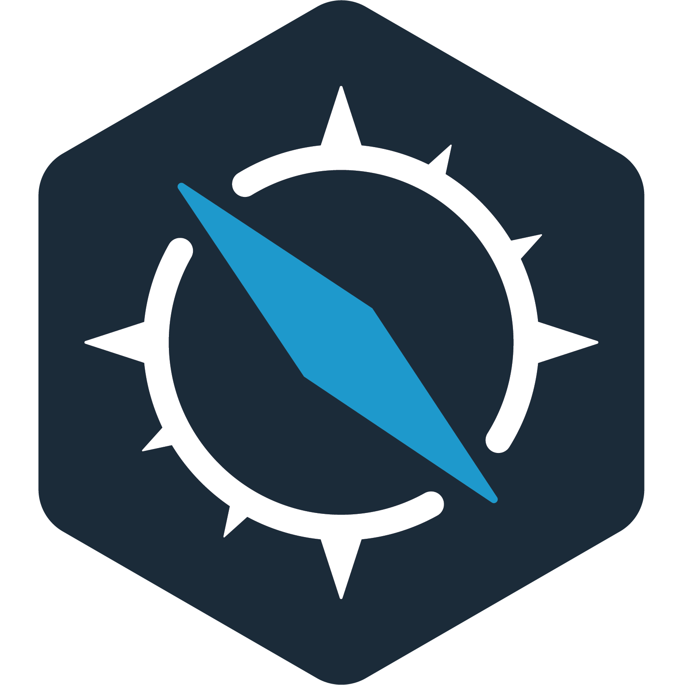

#  Suomitek-appboard

[](https://circleci.com/gh/suomitek/suomitek-appboard/tree/master)

Suomitek-appboard is a web-based UI for deploying and managing applications in Kubernetes clusters. Suomitek-appboard allows you to:

- Browse and deploy [Helm](https://github.com/helm/helm) charts from chart repositories
- Inspect, upgrade and delete Helm-based applications installed in the cluster
- Add custom and [private chart repositories](docs/user/private-app-repository.md) (supports [ChartMuseum](https://github.com/helm/chartmuseum) and [JFrog Artifactory](https://www.jfrog.com/confluence/display/RTF/Helm+Chart+Repositories))
- Browse and provision external services from the [Service Catalog](https://github.com/kubernetes-incubator/service-catalog) and available Service Brokers
- Connect Helm-based applications to external services with Service Catalog Bindings
- Secure authentication and authorization based on Kubernetes [Role-Based Access Control](docs/user/access-control.md)

## Quick Start

Use the Helm chart to install the latest version of Suomitek-appboard: 

***Note:*** Suomitek-appboard supports both Helm 2 and Helm 3. For detailed instructions on how to install and use Suomitek-appboard follow the [Getting Started Guide](docs/user/getting-started.md).

```bash
helm repo add chartmuseum http://helm.yongchehang.com
# Helm 2 command
helm install --name suomitek-appboard --namespace suomitek-appboard chartmuseum/suomitek-appboard
# Helm 3 command
kubectl create namespace suomitek-appboard
helm install suomitek-appboard --namespace suomitek-appboard chartmuseum/suomitek-appboard --set useHelm3=true
``` 

## Developer Documentation

Please refer to:

- The [Suomitek-appboard Build Guide](docs/developer/build.md) for instructions on setting up the build environment and building Suomitek-appboard from source.
- The [Suomitek-appboard Developer Documentation](docs/developer/README.md) for instructions on setting up the developer environment for developing on Suomitek-appboard and its components.

## Next Steps

If you have followed the instructions for [installing Suomitek-appboard](docs/user/getting-started.md) check how to [use Suomitek-appboard](docs/user/dashboard.md) to easily manage your applications running in your cluster, or [look under the hood to see what's included in Suomitek-appboard](docs/architecture/overview.md).

## Useful Resources

- [Walkthrough for first-time users](docs/user/getting-started.md)
- [Detailed installation instructions](chart/suomitek-appboard/README.md)
- [Suomitek-appboard Dashboard documentation](docs/user/dashboard.md)
- [Suomitek-appboard components](docs/architecture/overview.md)
- [Roadmap](https://github.com/suomitek/suomitek-appboard/wiki/Roadmap)

## Differences from Monocular

The [Monocular](https://github.com/helm/monocular) project was designed to run a public search and discovery website for Helm repositories (e.g. https://hub.suomitek.com). Following its 1.0 release, Monocular is focused on delivering the experience for the Helm Hub.

Versions of Monocular 0.7 and older include a basic ability to install, view and delete Helm releases in a Kubernetes cluster. To focus on the Helm Hub experience, these [features have been removed](https://github.com/helm/monocular#looking-for-an-in-cluster-application-management-ui) since the 1.0 release and are no longer supported. We recommend users of Monocular's in-cluster features try Suomitek-appboard as it provides a more featured, robust and secure solution to managing Helm applications in your cluster.

## Community

- [#suomitek-appboard on Kubernetes Slack](https://kubernetes.slack.com/messages/suomitek-appboard)

Click [here](http://slack.k8s.io) to sign up to the Kubernetes Slack org.
